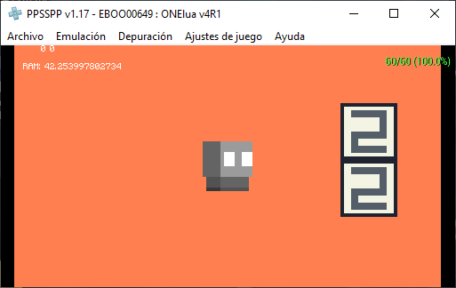

# cake.load_scene(path)

La función recibe el paramétro "path" de tipo string, donde se colocará
la ruta de la escena a cargar.

Ej:
```lua
    --Importar libería.
    require('cakemaker.cake')
    
    -- Incrementar la CPU.
    os.cpu(333)

    -- Cargar escena.
    cake.load_scene("src/scenes/default.json")

    while true do
        -- Leér las entradas.
        buttons.read()

        -- Actualizar eventos.
        cake.update()
        -- Establecer el modo "pixelado".
        screen.bilinear(0)

        -- Mostrar en pantalla.
        screen.flip()
    end
```


A continuación, un breve imagen que reprecenta la carga de una escena y todos sus
elementos:


