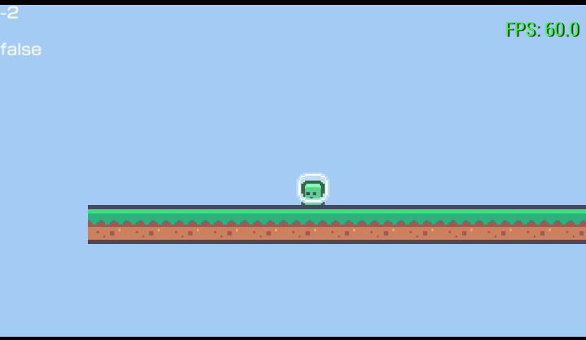

# CakeMaker.

Cakemaker es un framework que junto a [OneLua](http://onelua.x10.mx) agiliza la creación de proyectos
mediante la estructura de un [JSON](https://es.wikipedia.org/wiki/JSON) que permite ordenar los elementos.



Implementar cakemaker en tus proyecto facilitará la gestión de los archivos
separandolos en:
- Sonidos
- Animaciones
- Objetos

```json
{
    "sounds": [
        {
            "name": "jump",
            "res": "res/sounds/player/jump.mp3"
        }
    ],
    "animations": [
        {
            "name": "player_jump",
            "frames": [
                "res/animations/player/jump/frame0.png",
                "res/animations/player/jump/frame1.png",
                "res/animations/player/jump/frame2.png"
            ]
        }
    ],
    "objects": [
        {
            "name": "player",
            "animation": "player_jump",
            "x": 0,
            "y": 0,
            "w": 64,
            "h": 64
        }
    ]
}
```

# Integraciones de CakeMaker.

CakeMaker integra funciones propias para poder acceder al json y poder manipularlo de forma más comoda.

## Funciones Cake.
- [cake.load_scene(x)](functions/cake_load_scene.md)
- [cake.toHex(x)](functions/cake_toHex.md)
- [cake.get(x, y)](functions/cake_get.md)
- [cake.get_all(x)](functions/cake_get_all.md)
- [cake.set(x, y, z)](functions/cake_set.md)
- [cake.fliph(x)](functions/cake_fliph.md)
- [cake.flipv(x)](functions/cake_flipv.md)
- [cake.play(x)](functions/cake_play.md)
- [cake.update()](functions/cake_update.md)

# ¡Fuente inspirada en minecraft!
CakeMaker integra una fuente que está inspirada en el famoso juego sandbox
que te permitirá mostrar textos en pantalla de una forma única.
- [CakeFont](font/cake_font.md)
 
# Estructuras.
- [Sounds](structures/sounds.md)
- [Animations](structures/animations.md)
- [Objects](structures/objects.md)

